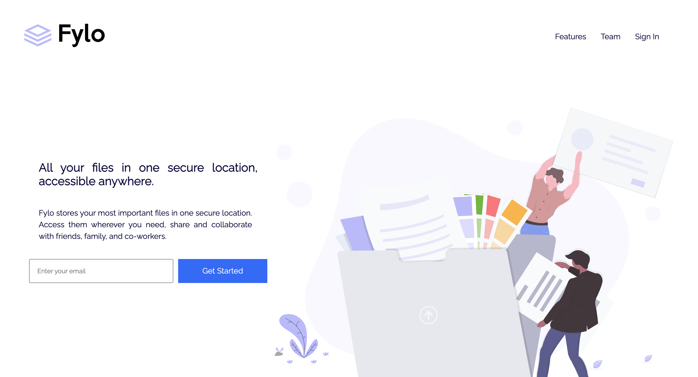
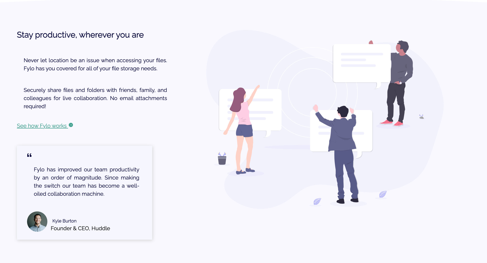
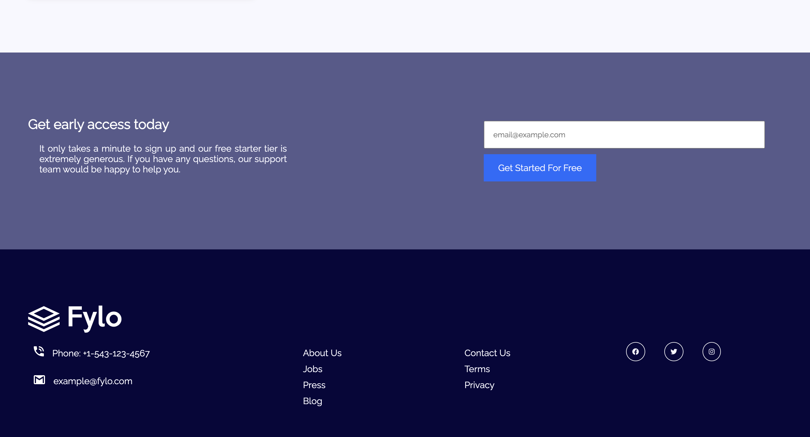
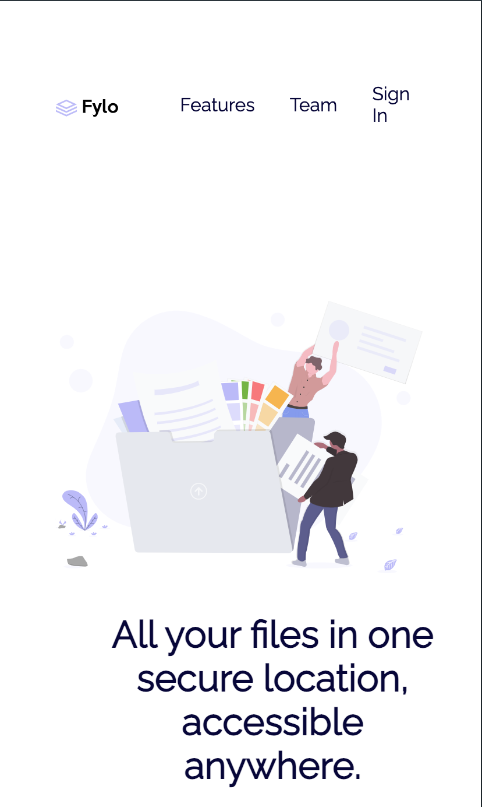
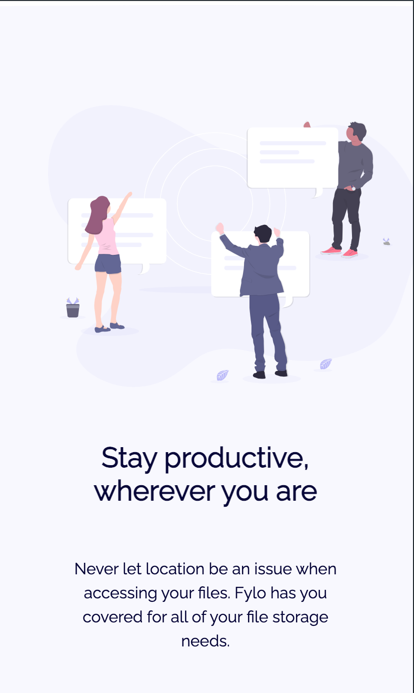
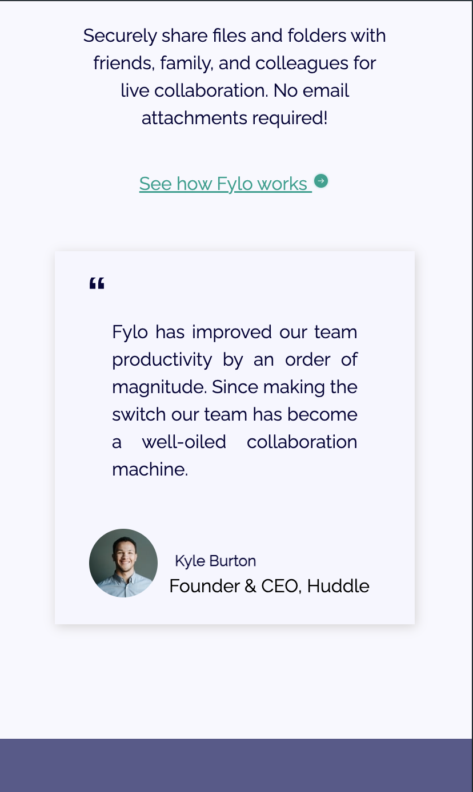
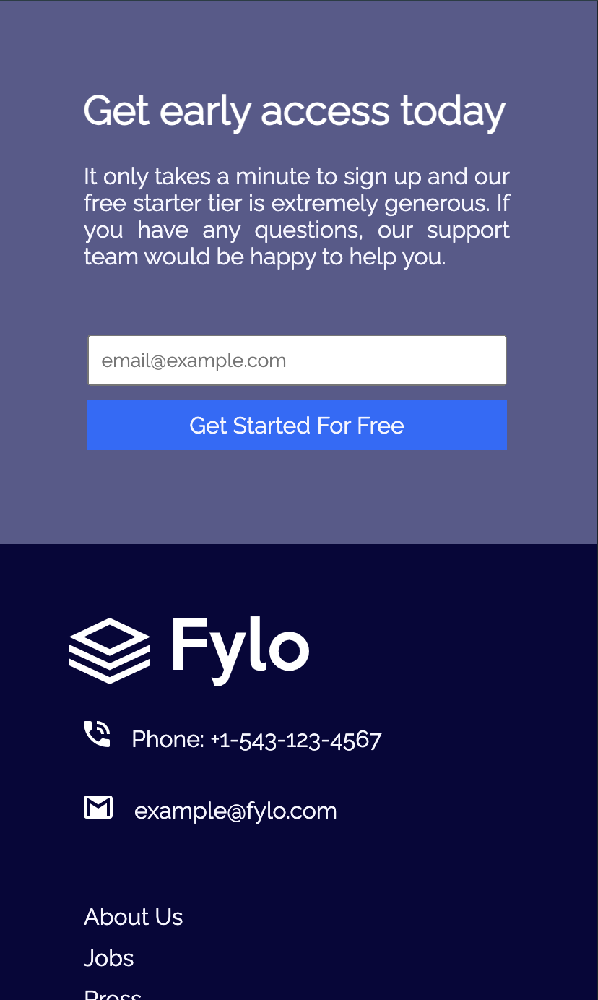
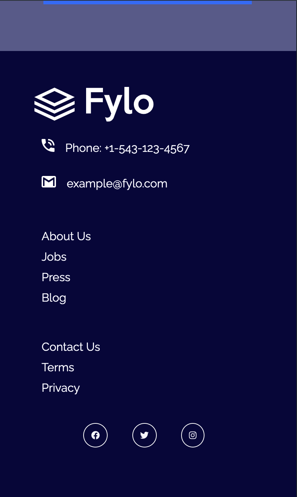

# Frontend Mentor - Fylo landing page with two column layout solution

This is a solution to the [Fylo landing page with two column layout challenge on Frontend Mentor](https://www.frontendmentor.io/challenges/fylo-landing-page-with-two-column-layout-5ca5ef041e82137ec91a50f5). Frontend Mentor challenges help you improve your coding skills by building realistic projects. 

## Table of contents

- [Overview](#overview)
  - [The challenge](#the-challenge)
  - [Screenshot](#screenshot)
  - [Links](#links)
- [My process](#my-process)
  - [Built with](#built-with)
  - [What I learned](#what-i-learned)
  - [Continued development](#continued-development)
  - [Useful resources](#useful-resources)
- [Author](#author)
- [Acknowledgments](#acknowledgments)

**Note: Delete this note and update the table of contents based on what sections you keep.**

## Overview

### The challenge

Users should be able to:

- View the optimal layout for the site depending on their device's screen size
- See hover states for all interactive elements on the page

### Screenshot

### Links

- Solution URL: [Solution URL here](https://github.com/muhammadtt97/fylo-landing-page)
- Live Site URL: [Add live site URL here](https://your-live-site-url.com)

## My process

### Built with

- Semantic HTML5 markup
- CSS custom properties
- Flexbox
- CSS Grid

### What I learned

Through this project, I learned how to effectively use CSS Flexbox and Grid to create responsive layouts. I also improved my skills in semantic HTML markup and CSS custom properties.

### Continued development

In future projects, I aim to further refine my skills in responsive design and explore more advanced CSS techniques and frameworks.

### Useful resources

- [MDN Web Docs](https://developer.mozilla.org/) - Comprehensive resource for HTML, CSS, and JavaScript documentation.
- [CSS-Tricks](https://css-tricks.com/) - Helpful articles, guides, and resources for CSS.

## Author

- Website - [Muhammad Alameen Adamu](https://alameentoro.com.ng)
- Frontend Mentor - [@muhammadtt97](https://www.frontendmentor.io/profile/muhammadtt97)
- Twitter - [@alameen_toro](https://www.twitter.com/alameen_toro)

## Acknowledgments

I would like to thank Zuri Internship for giving me the opportunity to learn with them and pointing me to this awesome website, Frontend Mentor. Their challenges have been invaluable for improving my coding skills.
